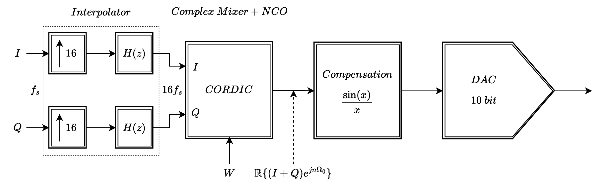

# Programmable Signal Generator

## System Overview
The **Programmable Signal Generator** is a software-simulated digital signal processing system designed to generate high-precision waveforms with tunable characteristics. The system consists of multiple components, each responsible for a specific stage of signal processing, from initial preparation to final conversion.

    

## **Interpolator: Upsampling & Halfband Filtering**
The **interpolator** increases the sampling rate of the input signal, allowing for finer frequency resolution and smoother waveform synthesis. By introducing additional data points between samples, it ensures that subsequent processing steps operate on a higher resolution version of the signal. This step is essential for reducing distortion and improving overall signal integrity. The **halfband filter** is a specialized filter that refines the interpolated signal by removing unnecessary high-frequency artifacts. It plays a critical role in maintaining spectral clarity, ensuring that the signal remains well-formed before it undergoes further transformations.

## **Complex Mixer: Frequency Shifting**
The **complex mixer** is a component that allows the system to precisely shift the signal to a desired center frequency. This is achieved using the **Numerically Controlled Oscillator (NCO)** for precise phase synthesis and the **CORDIC (Coordinate Rotation Digital Computer) algorithm**, an efficient iterative method for computing trigonometric functions. The CORDIC-based complex mixer enables precise phase and frequency control while maintaining computational efficiency, making it well-suited for real-time signal processing.

## **$sinc(x)$ Compensation Filter**
A key challenge in digital signal processing is compensating for artifacts introduced by the digital-to-analog conversion process. The **$\displaystyle sinc(x)$ compensation filter** corrects for signal distortions caused by the inherent frequency response of the DAC, ensuring that the output signal maintains its intended shape and spectral properties.

## **Digital-to-Analog Converter**
Since this system is fully software-based, the DAC simulation models the behavior of a real-world digital-to-analog converter. Two output modes are available, each affecting how the signal is represented in its final form:
- **NRZ (Non-Return-to-Zero) Mode** maintains a continuous output between samples.
- **RF Mode** allows direct synthesis of high-frequency signals.

## Conclusion
The **Programmable Signal Generator** is designed as a modular and flexible system for high-precision waveform synthesis. Each component plays a crucial role in processing, transforming, and refining the signal before it reaches the final output stage.

By leveraging **interpolation, frequency shifting using CORDIC, filtering, and DAC simulation**, this system allows for software-only signal generation without requiring dedicated hardware. Its structured approach ensures scalability, making it a valuable tool for signal processing research, algorithm development, and simulation-based waveform generation.

For a deeper look into the mathematical principles behind each component, see the [Mathematical Background](MATH.md).

For general project information, installation, and usage, see the [README](../README.md).
