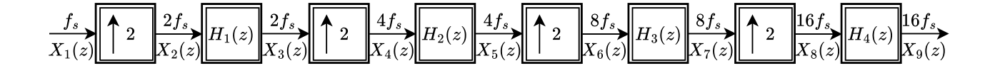
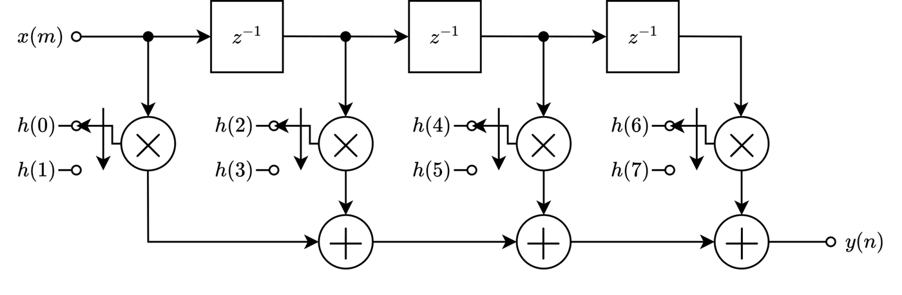
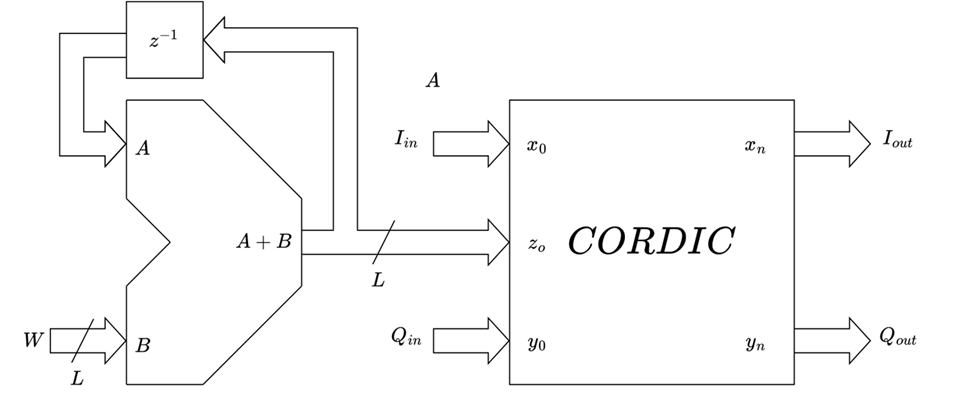

# Programmable Signal Generator - Mathematical Background

## **Interpolator**
An **interpolator** increases the sampling rate of a signal by inserting new samples and applying a **low-pass filter** to reconstruct the missing information. This prevents aliasing and ensures a smooth transition between original and newly generated samples.

### **Multistage Interpolation**
Instead of performing direct interpolation by a factor of 16, the system uses a multistage interpolation process, where multiple **FIR filters** applied sequentially. The goal is to reduce computational complexity, as designing a single FIR filter with the direct interpolation would require an extremely high-order filter.

The process follows these steps:
- **Upsample the signal** (insert zeros between samples)
- **Filter with a FIR filter**
- **Repeat this process multiple times** until the desired sampling frequency is achieved

This staged approach reduces computational load because each filter operates at a lower interpolation factor, which significantly decreases the required filter order.

### **FIR Filters Design**
**Halfband filters** are computationally more efficient than traditional low-pass filters because every second coefficient is zero, reducing the required multiplications by nearly 50%. Additionally, their fixed stopband makes them ideal for interpolation, enabling efficient multi-stage signal processing with minimal complexity.

#### **FIR Filter Requirements**
To design the FIR filters, we need to determine:
- The **passband frequency:**
    The passband frequency in a multi-stage interpolation system depends on the **maximum signal frequency**, **the interpolation factor** and **the sampling frequency**:

    $$F_{pass} = \frac{f_{max}}{Mf_s}$$

    This ensures that each interpolation stage maintains the desired signal bandwidth and prevents aliasing.

- The **stopband frequency:**
    For the halfband filters stopband frequencyis fixed:

$$F_{stop} = \frac{f_s}{4}$$

- The **filter order:**
    For optimal FIR filter calculated using **Remez algorithm**, the required filter order is estimated using **Harris' formula**:

    $$N = \frac{A_{dB}}{46(0.5 - 2F_{pass})}$$

    Since FIR filters require even orders, we ensure:

    $$N = 2 \times \left\lceil\frac{N}{2}\right\rceil$$

#### **Remez Algorithm**
The **Remez exchange algorithm** (also known as the **Parks-McClellan algorithm**) is an optimal FIR filter design technique based on the **Chebyshev approximation**. It finds the filter coefficients that minimize the maximum deviation from the ideal filter response, resulting in a **minimax optimal filter**.

Given a desired frequency response, the error function to minimize is:

$$E(\omega) = W(\omega)(H_d(\omega) - H(\omega))$$

The algorithm iteratively finds an optimal set of filter coefficients that distribute the error uniformly across frequency bands, leading to a flat error response in the passband and stopband. The designed filter must satisfy frequency constraints. The **passband ripple** is checked using:

$$\Delta_{pass} = 10^{-\frac{A_{dB}}{20}}$$

A filter satisfies the passband constraint if:

$$|H(\omega) - 1| \leq 2\Delta_{pass},\ \forall \omega \leq F_{pass}$$

If the filter does not meet these conditions, the order is increased, and the process repeats.

#### **Halfband Optimization**
A key property of halfband filters is that every alternate coefficient is zero except for the center tap:

$$h[n] =
\begin{cases}
    0.5, & n = \frac{N}{2} \\
    h[n], & n\ is\ even \\
    0, & n\ is\ odd
\end{cases}
$$

#### Polyphase Decomposition
Using direct convolution for filtering would be computationally expensive. Instead, we use **polyphase decomposition**, which splits the filter into multiple parallel sub-filters that operate at a lower sampling rate.

A discrete-time **FIR filter** can be decomposed as:

$$H(z) = \sum_{k=0}^{M - 1} z^{-1}H_k(z^M)$$

By restructuring the filter using polyphase decomposition, the system:
- **Processes the input at a lower sampling rate**, reducing computational cost.
- **Performs fewer multiplications per output sample**, making the system more efficient.

## **Complex Mixer**
A **complex mixer** is a digital signal processing block that shifts the frequency of a complex signal

$$S[n] = I[n] + jQ[n]$$

by multiplying it with a complex exponential:

$$e^{jn\Omega_0} = \cos(n\Omega_0) + j\sin(n\Omega_0)$$

This is implemented using an **NCO-CORDIC** system:
- **The NCO generates phase values** $\theta[n] = e^{jn\Omega_0}$
- **CORDIC computes** $\cos(\theta[n])$ and $j \sin(\theta[n])$
- The original signal is then multiplied by the computed sine and cosine:

$$\hat{I}[n] = I[n]\cos(\theta[n]) - Q[n]\sin(\theta[n])$$
$$\hat{Q}[n] = I[n]\sin(\theta[n]) + Q[n]\cos(\theta[n])$$

### **Numerically Controlled Oscillator (NCO)**
**A Numerically Controlled Oscillator (NCO)** is a digital frequency synthesizer that generates sinusoidal waveforms with high frequency resolution. An NCO operates based on a phase accumulator which increments the phase value by a fixed step size $W$ each clock cycle. This accumulated phase is then wrapped around at $2\pi$, forming a periodic waveform. Since the **CORDIC algorithm**, which computes sine and cosine, takes multiple iterations, the NCO introduces a latency (delay).

**NCO** has two key parameter:
- **Phase Accumulator Word Length** is the frequency resolution of the **NCO**. For the smallest frequency step the **NCO** must resolve (**frequency resolution**), minimum phase word length is:

$$L = \left\lceil\log_2(\frac{f_{res}}{f_s})\right\rceil$$

- **Phase Increment** is an update of the phase at each clock cycle and it is determined by the **output frequency**:

$$\theta[n] = \theta[n-1] + W$$
$$W = \frac{f_{out}2^L}{f_s}$$

### **CORDIC algorithm**
The **CORDIC (COordinate Rotation DIgital Computer) algorithm** is an iterative algorithm used to efficiently compute sine and cosine values using only bit shifts and additions. The **CORDIC algorithm** iteratively rotates a vector until it aligns with the desired phase, which comes from the **NCO** phase accumulator.

After fixed number of iterations, the algorithm converges.

Since the **CORDIC algorithm** output is processed by the **Digital-to-Analog Converter (DAC)**, the minimum required number of iterations depends on the precision of **DAC**.  However, because the **CORDIC algorithm** introduces internal calculation errors, additional *guard* bits are included to compensate these inaccuracies. The required number of iterations is given by::

$$N_{iter} = N_{DAC} + N_{guard} = N_{DAC} + \left\lceil\ \log_{2}N_{DAC}\right\rceil$$

#### Initialization
At the beginning of the **CORDIC** algorithm inputs are set to the initial values:
- $v_0 = x_0 + jy_0,\ (x_0,\ y_0) = (1,\ 0)$ - Initial complex unit vector
- $z_0 = \theta[n]$ - Initial phase error from the **NCO**
- $f_i = 1 + j2^{-i},\ i = \overline{1,\ N}$ - Precomputed rotation factors
- $\alpha_i = arg(f_i) = \arctan(2^{-i})$ - Precomputed rotation angles

#### Iterative Process
At each iteration $i$, the algorithm:

- **Rotate the vector forward or backward, based on the current phase error**:

$$v_{i+1} =
\begin{cases}
    v_i f_i, & 0 < z_i < \frac{W}{2} \rightarrow forward \\
    v_i f_{i}^{*}, & otherwise \rightarrow backward
\end{cases}
$$

- **Adjust the phase error to ensure that the angle wraps around within the valid range**:

$$z_{i+1} =
\begin{cases}
    mod((z_i - \alpha_i + W),\ W), & 0 < z_i < \frac{W}{2} \\
    mod((z_i + \alpha_i + W),\ W), & otherwise
\end{cases}
$$

#### Convergence
Each iteration reduces the **phase error**, bringing it closer to 0. After $N$ iterations the input vector has rotated by desired phase:

$$v_N = \cos(\theta[n]) + j\sin(\theta[n]) = e^{jn\Omega_0}$$

Each iteration produces an output that must be corrected using a scaling factor:

$$K_i = \frac{1}{\sqrt{1 + 2^{-2i}}}$$

## $sinc(x)$ **Compensation Filter**
In a **digital-to-analog converter (DAC)**, when the output is held constant between sample points (**Zero-Order Hold**), the frequency response of the system is affected by a **sinc function** distortion:

$$H(f) = \frac{\sin(\pi fT_s)}{\pi fT_s}$$

This low-pass filtering effect causes amplitude attenuation at higher frequencies, especially near the Nyquist frequency. Sinc compensation is used to correct this distortion by pre-emphasizing the higher frequencies before conversion. To counteract this effect, we apply a pre-filter that boosts the high frequencies by the **inverse sinc function** before sending the signal to the **DAC**:

$$H_{compensation}(f) = \frac{\pi fT_s}{\sin(\pi fT_s)}$$

However, because the inverse sinc function is not perfectly realizable, we need to approximate it using a finite-order digital filter. The iterative design process starts with a low-order filter, evaluates its frequency response against the ideal inverse sinc function, and incrementally increases the filter order until the error falls below an error margin.

## **Digital-to-Analog Converter**
A **Digital-to-Analog Converter (DAC)** converts discrete digital samples into a continuous analog signal by holding each sample value for a sampling period. The continuous output can be represented as:

$$x(t) = \sum_{n} x[n]h(t - nT_s)$$

The output spectrum is shaped by the **zero-order hold** effect, leading to a sinc-shaped frequency response:

$$H_{DAC}(f) = \frac{\sin(\pi fT_s)}{\pi fT_s}$$

which attenuates high-frequency components.

### **Non-Return-to-Zero (NRZ) Mode**
In **NRZ** mode, each digital sample is held constant for the full sampling period $T_s$, meaning the **DAC** output is a staircase-like waveform. The impulse response of the **DAC** in **NRZ** mode can be modeled as:

$$h_{NRZ}(t) =
\begin{cases}
    1, & 0 \leq t < T_s \\
    0, & otherwise
\end{cases}
$$

while the frequency response of the **DAC** in **NRZ** mode can be modeled as:

$$H_{NRZ}(f) = T_s sinc(fT_s)$$

This means:
- **The first zero occurs at** $f_s$
- **The main lobe extends from DC to** ${f_s}$
- **Attenuation is lowest, making the signal usable in the first Nyquist zone** $f\in [0,\ \frac{f_s}{2}]$

### **Bipolar Non-Return-to-Zero (RF) Mode**
**RF** Mode is a **DAC** output mode where each sample is held at $+V$ for half of the sampling period, and at $-V$ for the second half. This results in a balanced, alternating waveform that improves spectral properties by reducing even-order harmonics. The impulse response of the **DAC** in **RF** mode can be modeled as:

$$h_{RF}(t) =
\begin{cases}
    1, & 0 \leq t < \frac{T_s}{2} \\
    -1, & \frac{T_s}{2} \leq t < T_s \\
    0, & otherwise
\end{cases}
$$

while the frequency response of the **DAC** in **RF** mode can be modeled as:

$$H_{RF}(f) = T_s sinc(\frac{fT_s}{2})\sin(\frac{\pi fT_s}{2})e^{-j(\pi f T_s - \frac{\pi}{2})}$$

This means:
- **The first zero occurs at DC**
- **The main lobe extends from DC to** $2f_s$
- **Attenuation is lowest, making the signal usable in the second Nyquist zone** $f\in [\frac{f_s}{2},\ f_s]$

## Conclusion
The multi-stage **interpolation** approach, combined with **polyphase filtering**, reduces computational complexity while ensuring a smooth, high-resolution signal. The **complex mixer**, implemented using an **NCO** and **CORDIC**, enables precise frequency shifts while maintaining signal integrity. The effects of **DAC** operation in **NRZ** and **RF** modes illustrate how spectral shaping influences signal reconstruction and how **sinc compensation** corrects amplitude roll-off.

## Next Steps
For details on testing and validation methods used in this system, see [Testing & Validation](TESTING.md).

For a detailed breakdown of the system’s architecture, see the [System Architecture](ARCHITECTURE.md).
