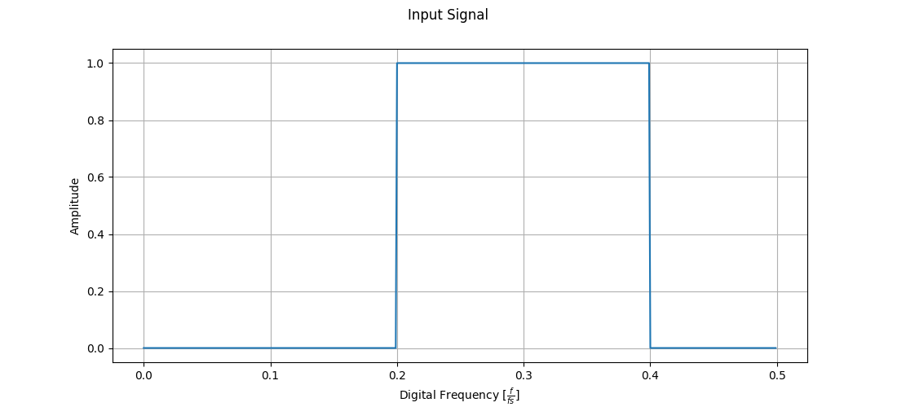
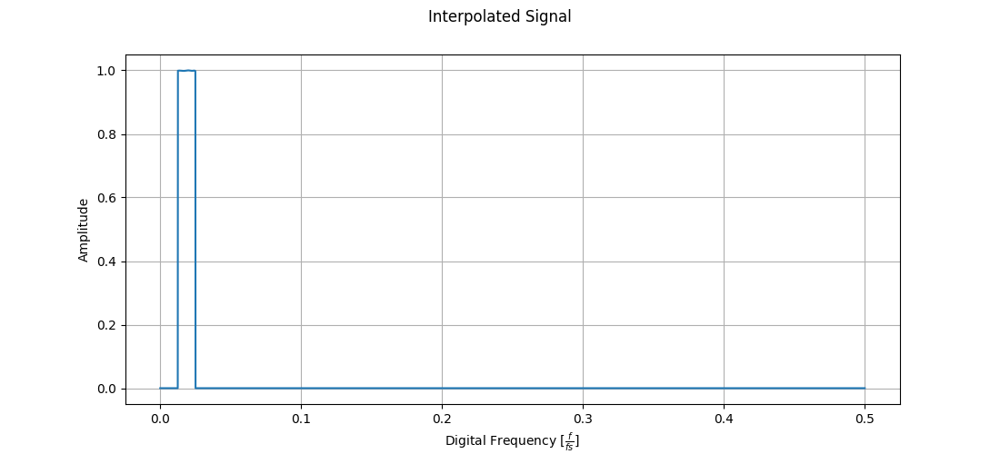
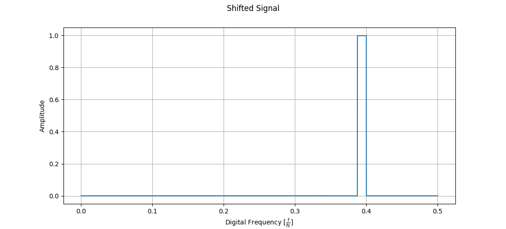
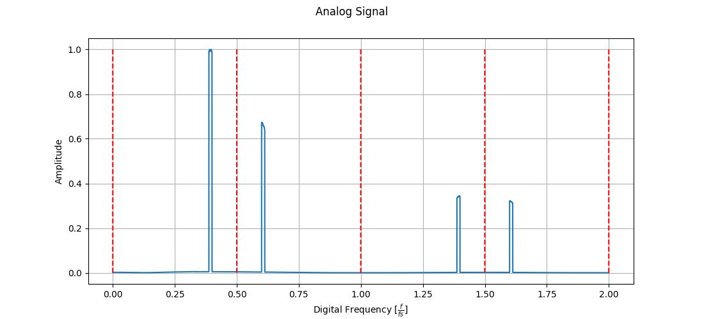
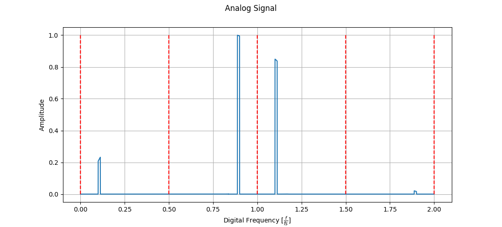

# Programmable Signal Generator - Testing & Validation Guide

## Overview
Testing strategies ensure the accuracy, reliability, and performance of the Programmable Signal Generator. Testing is divided into unit tests, integration tests, and coverage analysis, ensuring every component functions correctly in isolation and as part of the overall system.

## Testing Frameworks
### C++ Testing
- **Google Test (gtest), Google Mock (gmock)** – Testing framework for C++
- **LLVM `llvm-cov`** – Code coverage analysis
- **Valgrind** (optional) – Memory leak detection (Linux/macOS only)

### Python Testing
- **pytest** – Testing framework for Python
- **pytest-cov** – Code coverage analysis
- **mypy** – Static type checking for Python

### Compatibility Notice
For compatibility details, see the [Testing Framework Compatibility](COMPATIBILITY.md)

## Installing Dependencies
Ensure that all required dependencies are installed.

### C++ Dependencies
- **CMake** – Build system for compiling tests
- **LLVM (`llvm-cov`)** – Required for C++ code coverage (**Only works with Clang**)
- **Make or Ninja** – For compiling tests

**C++ code coverage is only supported with Clang**
- If using **GCC or MSVC**, code coverage will not be available.
- Windows users must run tests inside **WSL with Clang/LLVM**.

### Python Dependencies
- **pytest** – Python unit testing framework
- **pytest-cov** –  Python code coverage tool
- **mypy** – Static type checking

### Installation
#### 1. Linux/WSL
```sh
sudo apt update && sudo apt install -y git cmake clang lld make python3.10 python3.10-venv llvm lcov

python3 -m venv .venv
source .venv/bin/activate
pip install -r requirements.txt
```

#### 2. macOS
```sh
brew install git cmake clang llvm make python@3.10 lcov

python3 -m venv .venv
source .venv/bin/activate
pip install -r requirements.txt
```

## Unit Testing
Unit testing ensures that individual components of the system function correctly in isolation. Each module is tested independently to verify expected behavior under different conditions.

### Scope of Unit Testing
- Validate **Interpolator**, **Complex Mixer**, **Sinc Compensation Filter**, and **Digital-to-Analog Converter**.
- Verify **data processing functions and signal transformations**.
- Verify **numerical stability, edge case handling, and computational performance**.

###  Running Unit Tests
#### C++ Tests
```sh
mkdir -p tests/build && cd tests/build
cmake ..
make
./unitTests
```

#### Python Tests
```sh
source .venv/bin/activate
PYTHONPATH=./src/python pytest tests/python/unit
```

### Test File Location
| **Language**       | **Directory**    |
|--------------------|------------------|
| C++ Unit Tests     | `tests/cpp/unit`      |
| Python Unit Tests  | `tests/python/unit`   |

For detailed test cases, see the corresponding test files in `tests/<language>/unit`.

## Integration Testing
Integration tests verify that the various components of the Programmable Signal Generator work together correctly. These tests ensure that data flows properly between modules, that signal transformations are performed as expected, and that the overall system produces the correct output when given a known input.

### Scope of Integration Testing
- Verify core modules, **Interpolator**, **Complex Mixer**, **Sinc Compensation Filter**, and **Digital-to-Analog Converter interact correctly, ensuring data is passed seamlessly between them**.
- Ensure **complete processing chain produces the expected output**.
- Assess **performance and robustness of the overall system when all components are integrated**.

### Visual Overview of the Signal Processing Chain
The following images illustrate the key steps in our Programmable Signal Generator’s signal processing pipeline. Each step transforms the signal toward its final analog output, with distinct processing for **NRZ (Non-Return-to-Zero)** and **RF (Bipolar Non-Return-to-Zero)** modes.

#### 1. Input Signal:
This image shows the raw digital input signal as captured by the **ADC**. It serves as the starting point for the processing chain.


#### 2. Interpolated Signal:
The input signal is upsampled (interpolated) to increase the resolution and smoothness of the spectrum. This step prepares the signal for accurate frequency shifting and further processing.


#### 3a. Shifted Signal (NRZ Mode):
Using a **CORDIC algorithm**, the interpolated signal is frequency shifted into the **first Nyquist zone**. This placement is optimal for **NRZ** mode, ensuring that the signal's frequency components align with the **DAC**'s requirements for **NRZ** output.


#### 3b. Shifted Signal (RF Mode):
Similarly, the **CORDIC algorithm** shifts the interpolated signal into the **second Nyquist zone**. This mode-specific transformation prepares the signal for **RF** mode operation by positioning its frequency content in the zone most suitable for **RF** **DAC** processing.


#### 4a. Analog Signal Output (NRZ Mode):
After shifting the signal is passed through an **inverse $sinc$ FIR filter** to counteract the distortion introduced by the **DAC**’s inherent $sinc$ response. This simulated **DAC** output provides the corrected analog spectrum for NRZ mode.


#### 4b. Analog Signal Output (RF Mode):
For **RF** mode, following the shift, the signal is converted to analog in a mode optimized for **RF** applications. In this mode, the inherent **DAC** response is appropriate, so no additional filtering is applied, yielding a spectrum tailored for **RF** operation.


###  Running Integration Tests
#### C++ Tests
```sh
mkdir -p tests/build && cd tests/build
cmake ..
make
./integrationTests
```

#### Python Tests
```sh
source .venv/bin/activate
PYTHONPATH=./src/python pytest tests/python/integration
```

### Test File Location
| **Language**              | **Directory**              |
|---------------------------|----------------------------|
| C++ Integration Tests     | `tests/cpp/integration`    |
| Python Integration Tests  | `tests/python/integration` |

For detailed test cases, see the corresponding test files in `tests/<language>/integration`.

## **Code Coverage**
Code coverage ensures tests sufficiently exercise the codebase, identifying untested portions.

### Generating Coverage Reports
#### C++ Code Coverage
C++ code coverage is generated using **LLVM's `llvm-cov`**, which only works with **Clang**.
**MSVC and MinGW are not supported for code coverage.**
- Linux/macOS: **Native support with Clang**
- Windows: **Must use WSL with Clang/LLVM**
```sh
mkdir -p tests/build && cd tests/build
cmake ..
make
make coverage
```
#### Python Code Coverage
```sh
source .venv/bin/activate
PYTHONPATH=./src/python pytest --cov=./ --cov-report=html:htmlcov/python tests/python
```

### Coverage Report Locations
| **Language**       | **Directory**    |
|--------------------|------------------|
| C++ Unit Tests     | `htmlcov/cpp`      |
| Python Unit Tests  | `htmlcov/python`   |

To view coverage report:
```sh
firefox directory/index.html
```

## CI/CD Integration
The testing framework is integrated with **GitLab CI/CD**, ensuring automated testing and coverage reporting on every merge request.

### CI/CD Pipeline Overview
The pipeline is structured into the following stages:
| **Stage**    | **Purpose** |
|--------------|-------------|
| **Build**    | Compiles C++ tests |
| **Test**     | Runs both C++ (Google Test) and Python (pytest) tests, and generates coverage reports using `llvm-cov` and `pytest-cov` |
| **Deploy**   | Publishes coverage reports via **GitLab Pages** |

### When Does CI/CD Run?
The CI/CD pipeline is triggered in the following cases:
- On every merge request to `develop` or `main` branches
- On manual pipeline execution from **GitLab UI**

**The pipeline is blocked if tests fail**, ensuring only validated code is merged.

### GitLab CI/CD Coverage Badge


### GitLab Pages (Published Reports)
Deployed via GitLab Pages, coverage reports are accessible at:
- [C++ Code Coverage Report](https://mrgi23.gitlab.io/programmable-signal-generator/cpp/index.html)
- [Python Code Coverage Report](https://mrgi23.gitlab.io/programmable-signal-generator/python/index.html)


## Next Steps
For instructions on building and running the project, see the [Building Guide](BUILD.md).

For a more in-depth look into the mathematical principles behind each component, see the [Mathematical Background](MATH.md).
